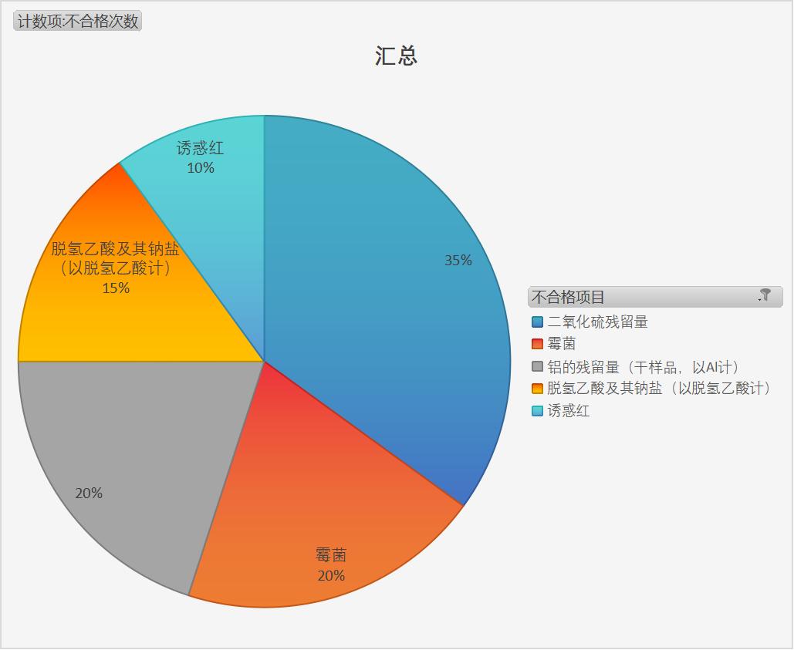
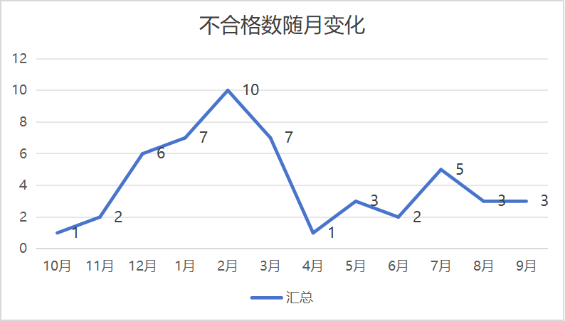

# 🍎 食品安全监督抽检数据分析

## 📊 项目亮点
- **数据规模**：处理18类食品、50条原始记录
- **技术难点**：多文件合并、微生物特殊格式处理、地址信息提取
- **核心发现**：严重超标占比高达50%

## 🎯 主要发现
### 1. 地域风险特征
- 欠发达地区本地不合格率高达86%
- 海南省、甘肃省是风险最集中的地区

### 2. 不合格项目分布
- 二氧化硫残留量是最常见问题（占35%）
- 微生物超标在粉类食品中最为严重

### 3. 企业风险画像
- 发现1家多次上榜的“问题企业”

## 🛠️ 技术实现
### 数据处理
- **工具**：Excel Power Query
- **难点攻克**：
  - 多文件批量合并与清洗
  - 微生物五管法数据的特殊处理
  - 非结构化地址信息的提取与标准化

### 分析与可视化
- **分析方法**：描述性统计、对比分析、趋势分析
- **可视化**：数据透视表、饼图、折线图

## 📈 关键图表

*严重超标占比极高*

*霉菌残留量是最突出问题（考虑危害以及次数）*

*上半年不合格数量显著高于下半年*
## 关键代码
添加超标程度 = Table.AddColumn(清洗标题,"超标程度",each try if Text.Contains([检验值],"CFU") and List.Count(List.Transform(Text.Split([检验值],"；"),each Expression.Evaluate(Text.Replace(Text.BeforeDelimiter(_,"C"),"×","*"))))=5 then "五法另算" else if Text.Contains([检验值],"未检出") then "含量不足" else if Text.Contains([标准值],"不得使用") or (Number.From(Text.Start([检验值],Text.PositionOfAny([检验值],{"a".."z","A".."Z","μ"})))-Number.From(Text.Middle([标准值],1,Text.PositionOfAny([标准值],{"a".."z","A".."Z","µ"})-1)))/Number.From(Text.Middle([标准值],1,Text.PositionOfAny([标准值],{"a".."z","A".."Z","µ"})-1))>1 then "严重超标" else if (Number.From(Text.Start([检验值],Text.PositionOfAny([检验值],{"a".."z","A".."Z","μ"})))-Number.From(Text.Middle([标准值],1,Text.PositionOfAny([标准值],{"a".."z","A".."Z","µ"})-1)))/Number.From(Text.Middle([标准值],1,Text.PositionOfAny([标准值],{"a".."z","A".."Z","µ"})-1))>0.5 then "中度超标" else "轻度超标" otherwise "暂不考虑")

## 📁 文件说明
- `国家市场监督管理总局不合格食品数据分析报告.docx` - **完整详细分析报告**（推荐阅读）
- `食品安全数据分析.xlsx` - 清洗后的分析数据
- `食品安全.M.PQ.txt` - 完整数据处理代码

## 🎓 项目价值
1. **技术价值**：展示了复杂数据处理与分析能力
2. **业务价值**：为食品安全监管提供了数据支持
3. **个人成长**：食品安全 + 数据分析的复合能力实践

## 📖 详细分析
**完整分析过程、详细数据解读、专业建议请查看：国家市场监督管理总局不合格食品数据分析报告.docx**
